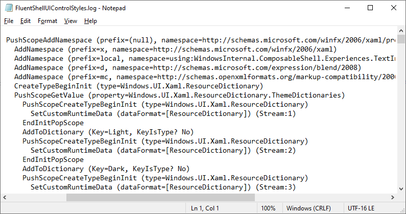

# xbfdump

Calls the dump facility provided by the Xaml Binary Format Reader that ships with the Microsoft Windows Software Development Kit.

Tested against SDK version 10.0.19041.0.

## Usage

Drop a copy of `genxbf.dll` into the same folder as `xbfdump.exe` and invoke with input/output parameters. (This library is typically found at `C:\Program Files (x86)\Windows Kits\10\bin\[sdk version]\XamlCompiler\x86`.)

    xbfdump input.xbf output.log
